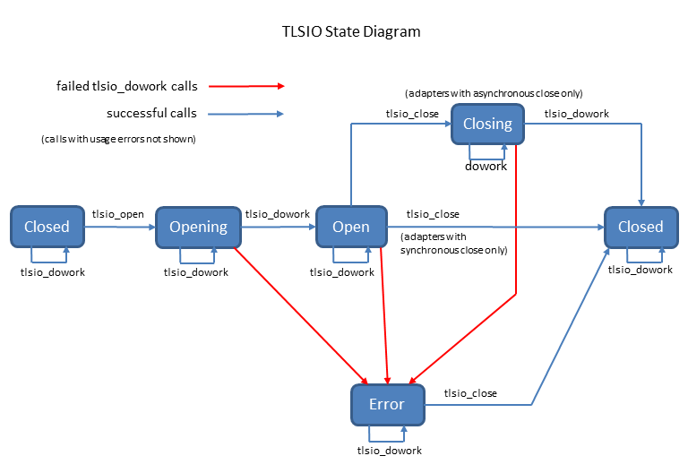

# tlsio

## Overview

This specification defines generic behavior for tlsio adapters, which operate primarily through the `xio` 
interface and provide communication to remote systems over a TLS-conformant secure channel.

## References

[TLS Protocol (RFC2246)](https://www.ietf.org/rfc/rfc2246.txt)

[TLS Protocol (generic information)](https://en.wikipedia.org/wiki/Transport_Layer_Security)

[tlsio base specification](https://github.com/Azure/azure-c-shared-utility/blob/master/devdoc/tlsio.md)

[xio.h](https://github.com/Azure/azure-c-shared-utility/blob/master/inc/azure_c_shared_utility/xio.h)


## Exposed API

**SRS_TLSIO_30_001: [** The tlsio shall implement and export all the Concrete functions in the VTable IO_INTERFACE_DESCRIPTION defined in the `xio.h`.
```c
typedef OPTIONHANDLER_HANDLE (*IO_RETRIEVEOPTIONS)(CONCRETE_IO_HANDLE concrete_io);
typedef CONCRETE_IO_HANDLE(*IO_CREATE)(void* io_create_parameters);
typedef void(*IO_DESTROY)(CONCRETE_IO_HANDLE concrete_io);
typedef int(*IO_OPEN)(CONCRETE_IO_HANDLE concrete_io, ON_IO_OPEN_COMPLETE on_io_open_complete, void* on_io_open_complete_context, ON_BYTES_RECEIVED on_bytes_received, void* on_bytes_received_context, ON_IO_ERROR on_io_error, void* on_io_error_context);
typedef int(*IO_CLOSE)(CONCRETE_IO_HANDLE concrete_io, ON_IO_CLOSE_COMPLETE on_io_close_complete, void* callback_context);
typedef int(*IO_SEND)(CONCRETE_IO_HANDLE concrete_io, const void* buffer, size_t size, ON_SEND_COMPLETE on_send_complete, void* callback_context);
typedef void(*IO_DOWORK)(CONCRETE_IO_HANDLE concrete_io);
typedef int(*IO_SETOPTION)(CONCRETE_IO_HANDLE concrete_io, const char* optionName, const void* value);


typedef struct IO_INTERFACE_DESCRIPTION_TAG
{
    IO_RETRIEVEOPTIONS concrete_io_retrieveoptions;
    IO_CREATE concrete_io_create;
    IO_DESTROY concrete_io_destroy;
    IO_OPEN concrete_io_open;
    IO_CLOSE concrete_io_close;
    IO_SEND concrete_io_send;
    IO_DOWORK concrete_io_dowork;
    IO_SETOPTION concrete_io_setoption;
} IO_INTERFACE_DESCRIPTION;
```
**]**

The following types from `xio.h` are also referenced in individual requirements.
```c

typedef enum IO_OPEN_RESULT_TAG
{
    IO_OPEN_OK,
    IO_OPEN_ERROR,
    IO_OPEN_CANCELLED
} IO_OPEN_RESULT;

typedef enum IO_SEND_RESULT_TAG
{
    IO_SEND_OK,
    IO_SEND_ERROR,
    IO_SEND_CANCELLED
} IO_SEND_RESULT;

typedef void(*ON_BYTES_RECEIVED)(void* context, const unsigned char* buffer, size_t size);
typedef void(*ON_SEND_COMPLETE)(void* context, IO_SEND_RESULT send_result);
typedef void(*ON_IO_OPEN_COMPLETE)(void* context, IO_OPEN_RESULT open_result);
typedef void(*ON_IO_CLOSE_COMPLETE)(void* context);
typedef void(*ON_IO_ERROR)(void* context);

typedef struct TLSIO_CONFIG_TAG
{
const char* hostname;
int port;
} TLSIO_CONFIG;
```


**SRS_TLSIO_30_003: [** Tlsio adapter implementations shall define and observe the internally defined `TLSIO_OPERATION_TIMEOUT_SECONDS` timeout value for opening, closing, and sending processes:
 ```c
// This value is considered an emergency limit rather than a useful tuning parameter,
// so it is not adjustable via the more expensive get / set options system
#ifndef TLSIO_OPERATION_TIMEOUT_SECONDS
#define TLSIO_OPERATION_TIMEOUT_SECONDS 40
#endif // !TLSIO_OPERATION_TIMEOUT_SECONDS
 ```
**]**

**SRS_TLSIO_30_004: [** If the tlsio implementation uses an internal buffer to pass data into the `on_bytes_received` callback, it shall define the size of this buffer with the internally defined `TLSIO_RECEIVE_BUFFER_SIZE` value.
  ```c
// The TLSIO_RECEIVE_BUFFER_SIZE has very little effect on performance, and is kept small
// to minimize memory consumption.
#ifndef TLSIO_RECEIVE_BUFFER_SIZE
#define TLSIO_RECEIVE_BUFFER_SIZE 64
#endif // !TLSIO_RECEIVE_BUFFER_SIZE
  ```
**]**

## External State
The external state of the tlsio adapter is determined by which of the adapter's interface functions have been called and which callbacks have been performed. The adapter's internal state should map cleanly to its external state, but the mapping is not necessarily 1:1. The external states are defined as follows:

* TLSIO_STATE_EXT_CLOSED means either that the module is newly constructed by `tlsio_create`, or that the `tlsio_close_async` complete callback has been received from a `tlsio_close_async` call.
* TLSIO_STATE_EXT_OPENING means that the `tlsio_open_async` call has completed successfully but the `on_tlsio_open_complete` callback has not been performed.
* TLSIO_STATE_EXT_OPEN means that the `on_tlsio_open_complete` callback has returned with `IO_OPEN_OK`.
* TLSIO_STATE_EXT_CLOSING means that the `tlsio_close_async` call has completed successfully but the `on_tlsio_close_complete` callback has not been performed.
* TLSIO_STATE_EXT_ERROR is the state entered (or maintained) after either of the following occurrences:
  * `on_tlsio_open_complete` has been called with `IO_OPEN_ERROR` from `tlsio_dowork`
  * `on_io_error` has been called from `tlsio_dowork`

## State Transitions
This list shows the effect of the calls as a function of state with happy internal functionality. Unhappy functionality is not shown but usually ends in TLSIO_STATE_EXT_ERROR. The `tlsio_setoption` and `tlsio_getoptions` calls are not shown because they have no effect on state and are always allowed. Calls to `tlsio_send_async` also do not affect state, and are allowed only during TLSIO_STATE_EXT_OPEN.

<table>
  <tr>From state <b>TLSIO_STATE_EXT_CLOSED</b></tr>
  <tr>
    <td>tlsio_destroy</td>
    <td>ok (destroyed)</td>
  </tr>
  <tr>
    <td>tlsio_open_async</td>
    <td>ok, enter TLSIO_STATE_EXT_OPENING</td>
  </tr>
  <tr>
    <td>tlsio_close_async</td>
    <td>fail, log error, remain in TLSIO_STATE_EXT_CLOSED (see "Usage error policy" below)</td>
  </tr>
  <tr>
    <td>tlsio_dowork</td>
    <td>ok (does nothing), remain in TLSIO_STATE_EXT_CLOSED</td>
  </tr>
</table>

<table>
  <tr>From state <b>TLSIO_STATE_EXT_OPENING</b> (guaranteed to exit by timeout)</tr>
  <tr>
    <td>tlsio_destroy</td>
    <td>log error, force immediate close, destroy (destroyed)</td>
  </tr>
  <tr>
    <td>tlsio_open_async</td>
    <td>fail, log error, remain in TLSIO_STATE_EXT_OPENING (see "Usage error policy" below)</td>
  </tr>
  <tr>
    <td>tlsio_close_async</td>
    <td>fail, log error, remain in TLSIO_STATE_EXT_OPENING (see "Usage error policy" below)</td>
  </tr>
  <tr>
    <td>tlsio_dowork</td>
    <td>ok (continue opening), remain in TLSIO_STATE_EXT_OPENING or enter TLSIO_STATE_EXT_OPEN</td>
  </tr>
</table>

<table>
  <tr>From state <b>TLSIO_STATE_EXT_OPEN</b></tr>
  <tr>
    <td>tlsio_destroy</td>
    <td>log error, force immediate close, destroy (destroyed)</td>
  </tr>
  <tr>
    <td>tlsio_open_async</td>
    <td>fail, log error, remain in TLSIO_STATE_EXT_OPEN (see "Usage error policy" below)</td>
  </tr>
  <tr>
    <td>tlsio_close_async</td>
    <td>adapters with internal async close: ok, enter TLSIO_STATE_EXT_CLOSING<br/>adatpers without internal async close: ok, enter TLSIO_STATE_EXT_CLOSING, then immediately enter TLSION_STATE_EXT_CLOSED</td>
  </tr>
  <tr>
    <td>tlsio_dowork</td>
    <td>ok (send and receive as necessary), remain in TLSIO_STATE_EXT_OPEN</td>
  </tr>
</table>

<table>
  <tr>From state <b>TLSIO_STATE_EXT_CLOSING</b> (guaranteed to exit by timeout)</tr>
  <tr>
    <td>tlsio_destroy</td>
    <td>log error, force immediate close, destroy (destroyed)</td>
  </tr>
  <tr>
    <td>tlsio_open_async</td>
    <td>fail, log error, remain in TLSIO_STATE_EXT_CLOSING (see "Usage error policy" below)</td>
  </tr>
  <tr>
    <td>tlsio_close_async</td>
    <td>fail, log error, remain in TLSIO_STATE_EXT_CLOSING (see "Usage error policy" below)</td>
  </tr>
  <tr>
    <td>tlsio_dowork</td>
    <td>ok (continue graceful closing) , remain in TLSIO_STATE_EXT_CLOSING or enter TLSIO_STATE_EXT_CLOSED</td>
  </tr>
</table>

<table>
  <tr>From state <b>TLSIO_STATE_EXT_ERROR</b></tr>
  <tr>
    <td>tlsio_destroy</td>
    <td>log error, force immediate close, destroy (destroyed)</td>
  </tr>
  <tr>
    <td>tlsio_open_async</td>
    <td>fail, log error, remain in TLSIO_STATE_EXT_ERROR (see "Usage error policy" below)</td>
  </tr>
  <tr>
    <td>tlsio_close_async</td>
    <td>ok, force immediate close, enter TLSIO_STATE_EXT_CLOSED</td>
  </tr>
  <tr>
    <td>tlsio_dowork</td>
    <td>ok (does nothing), remain in TLSIO_STATE_EXT_ERROR</td>
  </tr>
</table>



## Design Decisions

This section describes design decisions and their rationale. These decisions are not themselves part of the specifications, 
but the individual specifications will conform to these decisions.

**Retry policy**: the tlsio adapter shall not initiate error recovery of any sort.<br/>
**Reason for retry decision**: Decisions such as how, when, and whether to retry after error are high level policy 
decisions that are deliberately deferred to the higher level modules that own the tilso adapter. The tlsio adapter 
is not competent to make any guesses about what the correct retry behavior should be.

**Unsent messages policy**: the tlsio adapter shall discard any unsent messages when it receives a “close” command.<br/>
**Reasons for unsent messages decision**:
  1. This is consistent with existing tlsio adapters.<br/>
  2. Decisions about which messages should be re-sent after a (possibly lengthy) recovery must be deferred to higher level modules. Discarding all unsent messages upon `tlsio_close_async` puts that responsibility where it belongs.

**No fake sends policy**: although it would be possible to enqueue messages no matter what state the tlsio is in, the 
tlsio shall only accept messages for transmission when it is in the TLSIO_STATE_OPEN state.<br/>
**Reasons for no fake sends decision**:
  1. This is consistent with existing tlsio adapters.
  2. Accepting messages in other states amounts to poorly designed message queuing, and message queuing is already implemented properly at higher levels.
  3. Accepting messages in other states would require non-trivial design and unit test work and force the redesign of higher levels without adding any real functionality.

**No completion callbacks on failure**: If `tlsio_open_async` fails, the tlsio adapter shall call the supplied `on_io_open_complete` 
callback.<br/>
**Reason for redundant callback**: The reason for callbacks in the first place is because asynchronous operations cannot 
always provide all necessary feedback in their return values. In the case of a failed "begin operation" such as tlsio_open_async, 
the failure return already contains all of the useful information, making the callback redundant. In a greenfield design, 
simplicity would dictate that the callback not be made, but existing tlsio adapters already make this redundant callback, 
so new tlsio adpaters must conform to this behavior.

**Usage error policy**: If the caller commits usage errors, the tlsio adapter shall log the error and return failure, 
but shall not alter its internal state. Usage errors include:
* `tlsio_open_async`, `tlsio_send_async`, or `tlsio_close_async` are called during TLSIO_STATE_EXT_OPENING (invalid usage)
* `tlsio_open_async` is called during TLSIO_STATE_EXT_OPEN (invalid usage)
* `tlsio_open_async`, `tlsio_send_async`, or `tlsio_close_async` are called during TLSIO_STATE_EXT_CLOSING (invalid usage)
* `tlsio_open_async` or `tlsio_send_async` are called during TLSIO_STATE_EXT_ERROR (invalid usage)

**Reasons for usage error policy**:
* The behavior of existing tlsio adapters is not consistent in this regard. For example, tlsio_arduino does change state on usage errors but tlsio_open_ssl, tlsio_mbedtls, tlsio_schannel, and tlsio_wolfssl do not. Fortunately the upper-level modules that use tlsio adapters do not perform improper usage, so they don't depend on improper usage acting in any particular way.
* The tlsio adapter must handle and announce usage errors sensibly. But it is not possible to anticipate whether entering TLSIO_STATE_EXT_ERROR would aid the troubleshooting process or impede it, so the tlsio adapter shall favor design simplicity rather than getting its internal knickers in a knot by changing state when usage errors occur.

**Failed `tlsio_send_async` calls policy**: If the `tlsio_send_async` operation fails, the tlsio adapter shall log an error, return failure, and call the message's callback appropriately, but the adapter shall not change its internal state.<br/>**Reason for failed `tlsio_send_async` policy**: Tlsio adapters which conform to this spec enqueue incoming messages rather than sending them directly, so the only possible errors are usage errors and out-of-memory errors. Neither of these situations calls for the tlsio adapter to change its state, so it won't.

**Zero-length messages policy**: The `tlsio_send_async` call will not accept zero-length messages.<br/>**Reason for zero-length messages policy**: This behavior matches that of existing tlsio adapters.

**Mandatory callbacks policy**: All of the callback functions in the tlsio adapter API are mandatory.<br/>
**Reasons for mandatory callbacks policy**: 
* Tlsio adapters are designed for asynchronous operation, and correct usage of the adapter is difficult or impossible without using all of the callbacks.
* The higher-level SDK modules that use tlsio already provide the callback functions.
* Allowing optional callback functions would significantly increase the number of required unit tests.
* The cost to the caller of providing callback functions is trivial.

## Definitions 

#### Explicit state transitions

Throughout this document, state transitions only occur as explicitly specified. If no state transition is called out, then none is allowed. (So "do nothing" is always understood as the default.)
#### Specified state transitions

Requirements in this document use the phrase "shall enter TLSIO_STATE_EXT_XXXX" to specify behavior. Here are the definitions of the state transition phrases:

##### "enter TLSIO_STATE_EXT_ERROR"
**SRS_TLSIO_30_005: [** The phrase "enter TLSIO_STATE_EXT_ERROR" means the adapter shall call the `on_io_error` function and pass the `on_io_error_context` that was supplied in `tlsio_open_async`. **]**

##### "enter TLSIO_STATE_EXT_CLOSING"
**SRS_TLSIO_30_009: [** The phrase "enter TLSIO_STATE_EXT_CLOSING" means the adapter shall iterate through any unsent messages in the queue and shall delete each message after calling its `on_send_complete` with the associated `callback_context` and `IO_SEND_CANCELLED`. **]**

##### "enter TLSIO_STATE_EXT_CLOSED"
**SRS_TLSIO_30_006: [** The phrase "enter TLSIO_STATE_EXT_CLOSED" means the adapter shall forcibly close any existing connections then call the `on_io_close_complete` function and pass the `on_io_close_complete_context` that was supplied in `tlsio_close_async`. **]**

##### "enter TLSIO_STATE_EXT_OPENING"
The phrase "enter TLSIO_STATE_EXT_OPENING" means the adapter will continute the process of opening the TSL connection to the host on the next `tlsio_dowork` call, but no other externally visible action is being specified.

##### "enter TLSIO_STATE_EXT_OPEN"
**SRS_TLSIO_30_007: [** The phrase "enter TLSIO_STATE_EXT_OPEN" means the adapter shall call the `on_io_open_complete` function and pass IO_OPEN_OK and the `on_io_open_complete_context` that was supplied in `tlsio_open_async`. **]**

##### "destroy the failed message"
**SRS_TLSIO_30_002: [** The phrase "destroy the failed message" means that the adapter shall remove the message from the queue and destroy it after calling the message's `on_send_complete` along with its associated `callback_context` and `IO_SEND_ERROR`. **]**


## API Calls

###   tlsio_get_interface_description
```c
const IO_INTERFACE_DESCRIPTION* tlsio_get_interface_description(void);
```

**SRS_TLSIO_30_008: [** The tlsio_get_interface_description shall return the VTable IO_INTERFACE_DESCRIPTION. **]**


###   tlsio_create
Implementation of `concrete_io_create`
```c
CONCRETE_IO_HANDLE tlsio_create(void* io_create_parameters);
```

**SRS_TLSIO_30_010: [** The `tlsio_create` shall allocate and initialize all necessary resources and return an instance of the `tlsio` in TLSIO_STATE_EXT_CLOSED. **]**

**SRS_TLSIO_30_011: [** If any resource allocation fails, `tlsio_create` shall return NULL. **]**

**SRS_TLSIO_30_012: [** The `tlsio_create` shall receive the connection configuration as a `TLSIO_CONFIG*` in `io_create_parameters`. **]**

**SRS_TLSIO_30_013: [** If the `io_create_parameters` value is NULL, `tlsio_create` shall log an error and return NULL. **]**

**SRS_TLSIO_30_014: [** If the `hostname` member of `io_create_parameters` value is NULL, `tlsio_create` shall log an error and return NULL. **]**

**SRS_TLSIO_30_015: [** If the `port` member of `io_create_parameters` value is less than 0 or greater than 0xffff, `tlsio_create` shall log an error and return NULL. **]**

**SRS_TLSIO_30_016: [** `tlsio_create` shall make a copy of the `hostname` member of `io_create_parameters` to allow deletion of `hostname` immediately after the call. **]**


###   tlsio_destroy
Implementation of `concrete_io_destroy`
```c
void tlsio_destroy(CONCRETE_IO_HANDLE tlsio_handle);
```

**SRS_TLSIO_30_020: [** If `tlsio_handle` is NULL, `tlsio_destroy` shall do nothing. **]**

**SRS_TLSIO_30_021: [** The `tlsio_destroy` shall release all allocated resources and then release `tlsio_handle`. **]**

**SRS_TLSIO_30_022: [** If the adapter is in any state other than TLSIO_STATE_EX_CLOSED when `tlsio_destroy` is called, the adapter shall [enter TLSIO_STATE_EX_CLOSING](#enter-TLSIO_STATE_EXT_CLOSING "Iterate through any unsent messages in the queue and delete each message after calling its `on_send_complete` with the associated `callback_context` and `IO_SEND_CANCELLED`.") and then [enter TLSIO_STATE_EXT_CLOSED](#enter-TLSIO_STATE_EXT_CLOSED "Forcibly close any existing connections then call the `on_io_close_complete` function and pass the `on_io_close_complete_context` that was supplied in `tlsio_close_async`.") before completing the destroy process. **]**


###   tlsio_open_async
Implementation of `concrete_io_open`

```c
int tlsio_open_async(
    CONCRETE_IO_HANDLE tlsio_handle,
    ON_IO_OPEN_COMPLETE on_io_open_complete,
    void* on_io_open_complete_context,
    ON_BYTES_RECEIVED on_bytes_received,
    void* on_bytes_received_context,
    ON_IO_ERROR on_io_error,
    void* on_io_error_context);
```

**SRS_TLSIO_30_030: [** If the `tlsio_handle` parameter is NULL, `tlsio_open_async` shall log an error and return `_FAILURE_`. **]**

**SRS_TLSIO_30_031: [** If the on_io_open_complete parameter is NULL, `tlsio_open_async` shall log an error and return `_FAILURE_`. **]**

**SRS_TLSIO_30_032: [** If the on_bytes_received parameter is NULL, `tlsio_open_async` shall log an error and return `_FAILURE_`. **]**

**SRS_TLSIO_30_033: [** If the on_io_error parameter is NULL, `tlsio_open_async` shall log an error and return `_FAILURE_`. **]**

**SRS_TLSIO_30_037: [** If the adapter is in any state other than TLSIO_STATE_EXT_CLOSED when `tlsio_open_async` is called, it shall log an error, and return `_FAILURE_`. **]**

**SRS_TLSIO_30_038: [** If `tlsio_open_async` fails to  [enter TLSIO_STATE_EX_OPENING](#enter-TLSIO_STATE_EXT_OPENING "Continute the process of opening the TSL connection to the host on the next `tlsio_dowork` call") it shall return `_FAILURE_`. **]**

**SRS_TLSIO_30_039: [** On failure, `tlsio_open_async` shall call a non-NULL `on_io_open_complete` with the provided `on_io_open_complete_context` and IO_OPEN_ERROR. **]**

**SRS_TLSIO_30_034: [** On success, `tlsio_open_async` shall store the provided `on_bytes_received`,  `on_bytes_received_context`, `on_io_error`, `on_io_error_context`, `on_io_open_complete`,  and `on_io_open_complete_context` parameters for later use as specified and tested per other line entries in this document. **]**

**SRS_TLSIO_30_035: [** On success, `tlsio_open_async` shall cause the adapter to [enter TLSIO_STATE_EX_OPENING](#enter-TLSIO_STATE_EXT_OPENING "Continute the process of opening the TSL connection to the host on the next `tlsio_dowork` call") and return 0. **]**


###   tlsio_close_async
Implementation of `concrete_io_close`
```c
int tlsio_close_async(CONCRETE_IO_HANDLE tlsio_handle, ON_IO_CLOSE_COMPLETE on_io_close_complete, void* callback_context);
```

**SRS_TLSIO_30_050: [** If the `tlsio_handle` parameter is NULL, `tlsio_close_async` shall log an error and return `_FAILURE_`. **]**

**SRS_TLSIO_30_055: [** If the `on_io_close_complete` parameter is NULL, `tlsio_close_async` shall log an error and return `_FAILURE_`. **]**

**SRS_TLSIO_30_053: [** If the adapter is in any state other than TLSIO_STATE_EXT_OPEN or TLSIO_STATE_EXT_ERROR then `tlsio_close_async` shall log an error and return `_FAILURE_`. **]**

**SRS_TLSIO_30_056: [** On success the adapter shall [enter TLSIO_STATE_EX_CLOSING](#enter-TLSIO_STATE_EXT_CLOSING "Iterate through any unsent messages in the queue and delete each message after calling its `on_send_complete` with the associated `callback_context` and `IO_SEND_CANCELLED`."). **]**

**SRS_TLSIO_30_051: [** On success, if the underlying TLS does not support asynchronous closing, then the adapter shall [enter TLSIO_STATE_EXT_CLOSED](#enter-TLSIO_STATE_EXT_CLOSED "Forcibly close any existing connections then call the `on_io_close_complete` function and pass the `on_io_close_complete_context` that was supplied in `tlsio_close_async`.") immediately after entering TLSIO_STATE_EX_CLOSING. **]**

**SRS_TLSIO_30_052: [** On success`tlsio_close_async` shall return 0. **]**


###   tlsio_send_async
Implementation of `concrete_io_send`
```c
int tlsio_send_async(CONCRETE_IO_HANDLE tlsio_handle, const void* buffer, size_t size, ON_SEND_COMPLETE on_send_complete, void* callback_context);
```

**SRS_TLSIO_30_060: [** If the `tlsio_handle` parameter is NULL, `tlsio_send_async` shall log an error and return `_FAILURE_`. **]**

**SRS_TLSIO_30_061: [** If the `buffer` is NULL, `tlsio_send_async` shall log the error and return `_FAILURE_`. **]**

**SRS_TLSIO_30_062: [** If the `on_send_complete` is NULL, `tlsio_send_async` shall log the error and return `_FAILURE_`. **]**

**SRS_TLSIO_30_067: [** If the `size` is 0, `tlsio_send_async` shall log the error and return `_FAILURE_`. **]**

**SRS_TLSIO_30_065: [** If the adapter state is not TLSIO_STATE_EXT_OPEN, `tlsio_send_async` shall log an error and return `_FAILURE_`. **]**

**SRS_TLSIO_30_064: [** If the supplied message cannot be enqueued for transmission, `tlsio_send_async` shall return `_FAILURE_`. **]**

**SRS_TLSIO_30_066: [** On failure, a non-NULL `on_send_complete` shall be called with `callback_context` and IO_SEND_ERROR. **]**

**SRS_TLSIO_30_063: [** On success, `tlsio_send_async` shall enqueue for transmission the `on_send_complete`, the `callback_context`, the `size`, and the contents of `buffer` and then return 0. **]**


###   tlsio_dowork
Implementation of `concrete_io_dowork`
```c
void tlsio_dowork(CONCRETE_IO_HANDLE tlsio_handle);
```
The `tlsio_dowork` call executes async jobs for the tlsio. This includes connection completion, sending to the TLS connection, and checking the TLS connection for available bytes to read.

**SRS_TLSIO_30_070: [** If the `tlsio_handle` parameter is NULL, `tlsio_dowork` shall do nothing except log an error. **]**


#### Behavior selection

**SRS_TLSIO_30_071: [** If the adapter is in TLSIO_STATE_EXT_ERROR then `tlsio_dowork` shall do nothing. **]**

**SRS_TLSIO_30_075: [** If the adapter is in TLSIO_STATE_EXT_CLOSED then `tlsio_dowork` shall do nothing. **]**

**SRS_TLSIO_30_077: [** If the adapter is in TLSIO_STATE_EXT_OPENING then `tlsio_dowork` shall perform only the [TLSIO_STATE_EXT_OPENING behaviors](#TLSIO_STATE_EXT_OPENING-behaviors). **]**

**SRS_TLSIO_30_077: [** If the adapter is in TLSIO_STATE_EXT_OPEN  then `tlsio_dowork` shall perform only the [Data transmission behaviors](#data-transmission-behaviors) and the [Data reception behaviors](#data-reception-behaviors). **]**

**SRS_TLSIO_30_078: [** If the adapter is in TLSIO_STATE_EXT_CLOSING then `tlsio_dowork` shall perform only the [TLSIO_STATE_EXT_CLOSING behaviors](#TLSIO_STATE_EXT_CLOSING-behaviors). **]**

#### TLSIO_STATE_EXT_OPENING behaviors

Transitioning from TLSIO_STATE_EXT_OPENING to TLSIO_STATE_EXT_OPEN may require multiple calls to `tlsio_dowork`. The number of calls required is not specified.

**SRS_TLSIO_30_080: [** The `tlsio_dowork` shall establish a TLS connection using the `hostName` and `port` provided during `tlsio_open_async`. **]**

**SRS_TLSIO_30_081: [** If the connection process takes longer than the internally defined `TLSIO_OPERATION_TIMEOUT_SECONDS`, `tlsio_dowork`  shall log an error, call `on_io_open_complete` with the `on_io_open_complete_context` parameter provided in `tlsio_open_async` and `IO_OPEN_ERROR`, and  [enter TLSIO_STATE_EX_ERROR](#enter-TLSIO_STATE_EXT_ERROR "Call the `on_io_error` function and pass the `on_io_error_context` that was supplied in `tlsio_open_async`."). **]**

**SRS_TLSIO_30_082: [** If the connection process fails for any reason, `tlsio_dowork`  shall log an error, call `on_io_open_complete` with the `on_io_open_complete_context` parameter provided in `tlsio_open_async` and `IO_OPEN_ERROR`, and [enter TLSIO_STATE_EX_ERROR](#enter-TLSIO_STATE_EXT_ERROR "Call the `on_io_error` function and pass the `on_io_error_context` that was supplied in `tlsio_open_async`."). **]**

**SRS_TLSIO_30_083: [** If `tlsio_dowork` successfully opens the TLS connection it shall [enter TLSIO_STATE_EX_OPEN](#enter-TLSIO_STATE_EXT_OPEN "Call the `on_io_open_complete` function and pass IO_OPEN_OK and the `on_io_open_complete_context` that was supplied in `tlsio_open_async`."). **]**

#### Data transmission behaviors

**SRS_TLSIO_30_091: [** If `tlsio_dowork` is able to send all the bytes in an enqueued message, it shall call the messages's `on_send_complete` along with its associated `callback_context` and `IO_SEND_OK`. **]**

**SRS_TLSIO_30_093: [** If the TLS connection was not able to send an entire enqueued message at once, subsequent calls to `tlsio_dowork` shall continue to send the remaining bytes. **]**

**SRS_TLSIO_30_092: [** If the send process for any given message takes longer than the internally defined `TLSIO_OPERATION_TIMEOUT_SECONDS`, `tlsio_dowork` shall [destroy the failed message](#destroy-the-failed-message "Remove the message from the queue and destroy it after calling the message's `on_send_complete` along with its associated `callback_context` and `IO_SEND_ERROR`.") and [enter TLSIO_STATE_EX_ERROR](#enter-TLSIO_STATE_EXT_ERROR "Call the `on_io_error` function and pass the `on_io_error_context` that was supplied in `tlsio_open_async`."). **]**

**SRS_TLSIO_30_095: [** If the send process fails before sending all of the bytes in an enqueued message, `tlsio_dowork` shall [destroy the failed message](#destroy-the-failed-message "Remove the message from the queue and destroy it after calling the message's `on_send_complete` along with its associated `callback_context` and `IO_SEND_ERROR`.") and [enter TLSIO_STATE_EX_ERROR](#enter-TLSIO_STATE_EXT_ERROR "Call the `on_io_error` function and pass the `on_io_error_context` that was supplied in `tlsio_open_async`."). **]**

**SRS_TLSIO_30_096: [** If there are no enqueued messages available, `tlsio_dowork` shall do nothing. **]**

#### Data reception behaviors

**SRS_TLSIO_30_100: [** If the TLS connection is able to provide received data, `tlsio_dowork` shall read this data and call `on_bytes_received` with the pointer to the buffer containing the data, the number of bytes received, and the `on_bytes_received_context`. **]**

**SRS_TLSIO_30_102: [** If the TLS connection receives no data then `tlsio_dowork` shall not call the  `on_bytes_received` callback. **]**

#### TLSIO_STATE_EXT_CLOSING behaviors

Adapters whose underlying TLS connection does not have an asynchronous 'closing' state will not have an externally visible TLSIO_STATE_EXT_CLOSING state and so their `tlsio_dowork` will not perform these behaviors.

**SRS_TLSIO_30_105: [** If the closing process takes longer than the internally defined `TLSIO_OPERATION_TIMEOUT_SECONDS`, `tlsio_dowork` shall [enter TLSIO_STATE_EX_ERROR](#enter-TLSIO_STATE_EXT_ERROR "Call the `on_io_error` function and pass the `on_io_error_context` that was supplied in `tlsio_open_async`."). **]**

**SRS_TLSIO_30_106: [** If the closing process fails, `tlsio_dowork` shall [enter TLSIO_STATE_EX_ERROR](#enter-TLSIO_STATE_EXT_ERROR "Call the `on_io_error` function and pass the `on_io_error_context` that was supplied in `tlsio_open_async`."). **]**

**SRS_TLSIO_30_107: [** If the closing process ends gracefully, `tlsio_dowork` shall [enter TLSIO_STATE_EXT_CLOSED](#enter-TLSIO_STATE_EXT_CLOSED "Forcibly close any existing connections then call the `on_io_close_complete` function and pass the `on_io_close_complete_context` that was supplied in `tlsio_close_async`."). **]**

###   tlsio_setoption
Implementation of `IO_SETOPTION concrete_io_setoption`

The options are conceptually part of `tlsio_create` in that options which are set persist until the instance is destroyed. 
```c
int tlsio_setoption(CONCRETE_IO_HANDLE tlsio_handle, const char* optionName, const void* value);
```
**SRS_TLSIO_30_120: [** If the `tlsio_handle` parameter is NULL, `tlsio_setoption` shall do nothing except log an error and return `_FAILURE_`. **]**

**SRS_TLSIO_30_121: [** If the `optionName` parameter is NULL, `tlsio_setoption` shall do nothing except log an error and return `_FAILURE_`. **]**

**SRS_TLSIO_30_122: [** If the `value` parameter is NULL, `tlsio_setoption` shall do nothing except log an error and return `_FAILURE_`. **]**

**SRS_TLSIO_30_123 [** The `tlsio_setoption` shall do nothing and return 0. **]**

**SRS_TLSIO_30_123 [** The `tlsio_setoption` shall do nothing and return 0. **]**

**SRS_TLSIO_30_124 [** Adapters which implement options shall store the option value until `tlsio_destroy` is called. **]**


###   tlsio_retrieveoptions
Implementation of `IO_RETRIEVEOPTIONS concrete_io_retrieveoptions`

```c
OPTIONHANDLER_HANDLE tlsio_retrieveoptions(CONCRETE_IO_HANDLE tlsio_handle);
```

**SRS_TLSIO_30_160: [** If the `tlsio_handle` parameter is NULL, `tlsio_retrieveoptions` shall do nothing except log an error and return `_FAILURE_`. **]**

**SRS_TLSIO_30_161: [** The `tlsio_retrieveoptions` shall do nothing and return NULL. **]**

### Error Recovery Testing
Error recovery for tlsio adapters is performed by the higher level modules that own the tlsio. There are a very large
number of error recovery sequences which might be performed, and performing all of the possible retry sequences
is out-of-scope for this document. However, the two tests here represent a minimal test suite to mimic the retry
sequences that the higher level modules might perform.

The test conditions in this section are deliberately underspecified and left to the judgement of the implementer, and code commenting
in the unit tests themselves will be considered sufficient documentation for any further detail. Any of a number of possible
specific call sequences is acceptable as long as the unit test meets the criteria of the test requirement. 

The words "high-level retry sequence" as used in this section means that:
  1. A failure has been injected at some specified point
  2. `tlsio_close_async` has been called and the `on_io_close_complete` callback has been received.
  3. `tlsio_open_async` has been called successfully.
  4. `tlsio_dowork` has been called as necessary to permit this sequence of events.
  5. The `on_io_open_complete` callback has been received with `IO_OPEN_OK`.

Note that the requirements in this section have corresponding entries in the unit test files, but do not
appear in the implementation code.

**SRS_TLSIO_30_200: [** The "high-level retry sequence" shall succeed after an injected fault which causes 
`on_io_open_complete` to return with `IO_OPEN_ERROR`. **]**

**SRS_TLSIO_30_201: [** The "high-level retry sequence" shall succeed after an injected fault which causes 
 `on_io_error` to be called. **]**
